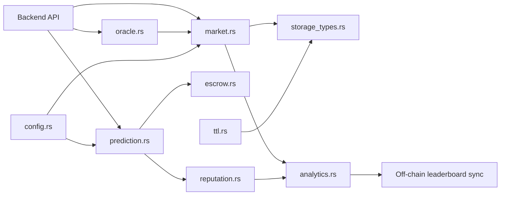

# InsightArena Contract

## 1) Overview
InsightArena's Soroban contract implements market lifecycle, prediction staking, settlement, payout distribution, reputation scoring, and season/leaderboard bookkeeping on-chain. The backend API acts as an orchestration layer around this contract: it creates markets, accepts predictions, resolves outcomes, and syncs event-driven state into PostgreSQL for query and analytics workloads.

## 2) Module Structure
| File | Purpose |
| --- | --- |
| `src/lib.rs` | Contract entry points and module wiring |
| `src/config.rs` | Global config and protocol constants |
| `src/errors.rs` | Contract error types and codes |
| `src/market.rs` | Market creation, update, and resolution logic |
| `src/prediction.rs` | Prediction submission and validation |
| `src/escrow.rs` | Stake locking and pooled fund accounting |
| `src/oracle.rs` | Outcome/oracle integration and checks |
| `src/governance.rs` | Admin and governance-related controls |
| `src/reputation.rs` | Reputation scoring updates |
| `src/season.rs` | Season boundaries and season state |
| `src/analytics.rs` | Aggregation and derived read logic |
| `src/invite.rs` | Invite/referral pathways |
| `src/security.rs` | Security helpers and guardrails |
| `src/storage_types.rs` | Storage key/value schema definitions |
| `src/ttl.rs` | TTL extension and storage retention helpers |
| `src/prediction_tests.rs` | Contract-focused test scenarios |

## 3) Quick Start
Run from `contract/` on a clean Ubuntu machine:

```bash
sudo apt-get update && sudo apt-get install -y build-essential pkg-config libssl-dev curl clang
curl https://sh.rustup.rs -sSf | sh -s -- -y
source "$HOME/.cargo/env" && rustup target add wasm32v1-none
cargo build
cargo test
```

## 4) Architecture Diagram


## 5) Key Data Flows
### Market creation
- Backend submits create-market call with title, outcomes, end/resolution times.
- `market.rs` validates config and writes market state to storage.
- Event data is emitted for backend listener synchronization.

### Prediction submission
- User submits market choice and stake amount via backend.
- `prediction.rs` validates market state and outcome.
- `escrow.rs` locks stake and updates pool totals.
- Reputation and analytics paths are updated for standings and metrics.

### Payout
- Oracle/admin resolves market outcome in `market.rs`/`oracle.rs`.
- Winners are validated against stored predictions.
- `escrow.rs` computes and releases claimable payout amounts.
- Claim events are emitted for off-chain sync and notification pipelines.

## 6) Environment Variables / Config
Primary backend-side runtime variables that must align with contract deployment:

- `STELLAR_NETWORK`: `testnet` or `mainnet`
- `SOROBAN_CONTRACT_ID`: deployed contract ID
- `SERVER_SECRET_KEY`: backend signer key used for privileged tx signing
- `SOROBAN_RPC_URL`: Soroban RPC endpoint (if omitted, backend default is used)

Contract constants and validation boundaries live in `src/config.rs`.

## 7) Testnet Deployment Guide
1. Build and test locally (`cargo build && cargo test`).
2. Install and configure Soroban CLI with a funded testnet identity.
3. Compile WASM artifact for deployment.
4. Deploy contract and capture resulting contract ID.
5. Set backend env values (`STELLAR_NETWORK`, `SOROBAN_CONTRACT_ID`, `SERVER_SECRET_KEY`, `SOROBAN_RPC_URL`) and run backend connection check.

Example Soroban CLI shape (adapt to your account/network settings):

```bash
soroban contract deploy \
  --wasm target/wasm32v1-none/release/contract.wasm \
  --source <identity> \
  --network testnet
```

## 8) Smoke Testing on Testnet

The smoke test script validates a full end-to-end flow on Stellar Testnet without requiring the frontend. It covers:

1. **Fund test wallets** via Friendbot
2. **Build contract** WASM artifact
3. **Deploy contract** to testnet
4. **Initialize contract** with admin and config
5. **Create market** with YES/NO outcomes
6. **Submit predictions** from two users with different outcomes
7. **Resolve market** via oracle with winning outcome
8. **Claim payouts** for winning predictions
9. **Verify final balances** match expected amounts

### Running Smoke Tests

```bash
# From contract/ directory
make smoke-test

# Or manually with custom network settings
ADMIN_SECRET=<your-secret> \
USER1_SECRET=<user1-secret> \
USER2_SECRET=<user2-secret> \
bash scripts/smoke_test.sh
```

### Prerequisites

- Soroban CLI installed and configured
- Funded testnet account (admin identity)
- Network connectivity to Stellar Testnet RPC

### Output

The script outputs clear ✅ PASS or ❌ FAIL messages at each step:

```
✅ PASS: Test wallets funded
✅ PASS: Contract built successfully
✅ PASS: Contract deployed: CAAAAAAAAAAAAAAAAAAAAAAAAAAAAAAAAAAAAAAAAAAAAAAAAAAABSC4
✅ PASS: Contract initialized
✅ PASS: Market created: market_id_123
✅ PASS: User 1 prediction submitted (YES, 1000000 stroops)
✅ PASS: User 2 prediction submitted (NO, 500000 stroops)
✅ PASS: Market resolved (outcome: YES)
✅ PASS: User 1 payout claimed: 1400000
✅ PASS: User 1 balance: 1400000 stroops
✅ PASS: User 2 balance: 0 stroops
🎉 Smoke test PASSED - All steps completed successfully!
```

## 9) Build Targets

Use `make` to run common tasks:

```bash
make build       # Build contract WASM
make test        # Run unit tests
make smoke-test  # Run testnet smoke tests
make clean       # Clean build artifacts
make help        # Show available targets
```

## 10) TWAP Price Oracle

Each AMM liquidity pool (`src/liquidity.rs`) maintains a manipulation-resistant
time-weighted average price (TWAP) per outcome, computed from a cumulative
price accumulator — the same technique used by Uniswap V2-style oracles.

### Accumulator math

For each `(market_id, outcome)` pair, `PriceAccumulator` (`src/storage_types.rs`)
tracks a running integral of `price * elapsed_seconds` over the pool's history,
plus a fixed-capacity ring buffer (`TWAP_RING_BUFFER_CAPACITY = 64`) of recent
`PriceObservation` snapshots (`timestamp`, `price`, `price_cumulative`).

On every reserve-changing operation (pool creation, `swap_outcome`),
`record_price_observation` extends the integral forward using the *previous*
price for however long it was active, then records a new observation:

```
cumulative_new = cumulative_old + last_price * (now - last_timestamp)
```

`get_twap(market_id, outcome, window)` reconstructs the integral at two
points — `now` and `now - window` — by locating the latest retained
observation at or before each timestamp and extrapolating with its price for
the remaining gap, then divides the difference by the elapsed time:

```
twap = (cumulative(now) - cumulative(now - window)) / window
```

Because the average is derived from a time integral rather than any single
spot price, a single large trade can only move the TWAP by roughly
`(trade_duration / window)` of its instantaneous price impact — this is what
makes the oracle manipulation-resistant to flash-loan-style single-block
price spikes.

### Guards

- `window == 0` → `TwapEmptyWindow`.
- No accumulator, or the window reaches further back than the oldest
  retained observation (either because the pool is younger than the window,
  or more than `TWAP_RING_BUFFER_CAPACITY` price-changing swaps have occurred
  and older samples were overwritten) → `TwapInsufficientHistory`.
- Degenerate zero-length elapsed time between the window boundaries →
  `TwapDivideByZero`.
- Unknown outcome for the market → `InvalidOutcome`.

### Entry points

- `get_twap(market_id, outcome, window)` — TWAP for a specific outcome.
- `get_market_twap(market_id, window_seconds)` — convenience view returning
  the TWAP of the market's primary outcome (`outcome_options[0]`), for
  consumers (indexer, UI) that track a single headline price per market.

## 11) Reputation Decay Over Inactive Seasons

A creator's reputation score (`reputation::calculate_creator_reputation`) is
decayed lazily, at read time, in two layers — neither ever mutates stored
counters, so there is no unbounded loop over elapsed time or seasons:

1. **Time-based decay** (`reputation::apply_reputation_decay`) — decays
   toward zero as seconds elapse since `CreatorStats::last_updated`, per the
   governance-configured `reputation_half_life_seconds` /
   `reputation_decay_mode` (Linear or Exponential).
2. **Season-inactivity decay** (`reputation::apply_season_inactivity_decay`)
   — for each season that has become the active season since the creator was
   last active, beyond a configurable grace period, the score is multiplied
   by `(10_000 - reputation_season_decay_bps) / 10_000`, compounding:

   ```
   decaying_seasons = inactive_seasons - grace_seasons   (0 if inactive_seasons <= grace_seasons)
   score' = score * ((10_000 - decay_bps) / 10_000) ^ decaying_seasons
   ```

   `inactive_seasons` is `current_active_season_id - last_active_season_id`.
   A creator's `last_active_season_id` is recorded (via a compact storage
   key, not a new field) whenever they create, resolve, or have a dispute
   raised against a market — the same hooks that already reset
   `last_updated` for time-based decay. Both decay layers apply in sequence
   (time-based first, then season-based) and neither can push the score
   below `0` (`u32` floor) or above its pre-decay value.

Governance parameters (`config.rs`, admin-settable via
`set_season_decay_config`):

- `reputation_season_decay_grace` — inactive seasons tolerated before decay
  starts. Defaults to `1`.
- `reputation_season_decay_bps` — decay rate per inactive season beyond the
  grace period, in bps (0-10000). `0` disables season decay. Defaults to
  `1000` (10%).

## 12) Links to Related Docs
- [Repository contribution guide](../backend/.github/CONTRIBUTING.md)
- [Contract security audit notes](./SECURITY_AUDIT.md)
- [Contract storage schema notes](./STORAGE_SCHEMA.md)
